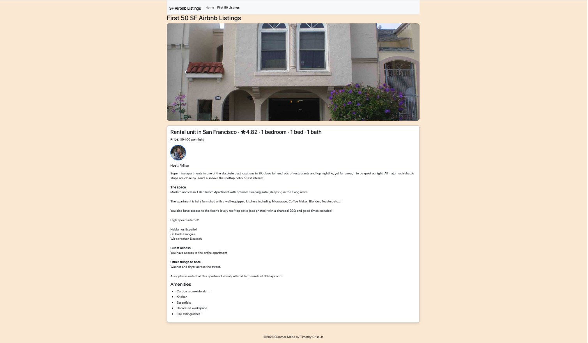

# SF Airbnb Listings JavaScript Demo

A small front-end web development project that dynamically loads and displays San Francisco Airbnb listing data using HTML, CSS, Bootstrap, and vanilla JavaScript.

This project demonstrates the use of JavaScript Fetch API, async/await, dynamic DOM rendering, Bootstrap components, and responsive front-end design techniques using a local JSON dataset.

---

## Project Objective

The goal of this project is to demonstrate how a responsive web application can dynamically load and display Airbnb-style listing information from a JSON dataset.

The application uses:
- HTML5 page structure
- Bootstrap 5 responsive components
- Custom CSS styling
- Vanilla JavaScript
- Fetch API with async/await
- Dynamic DOM manipulation

This project was created as a CS5610 Web Development self-assessment exercise.

---

## Screenshot

Add a screenshot or GIF of the finished page here before submitting:

```md

or (/images/demo.gif)
```

---

## Live Deployment

GitHub Pages deployment:

[View Live Website](https://crisst330.github.io/Airbnb_demo_page_self_assessment/)

---

## Features

- Dynamically loads the first 50 Airbnb listings from a local JSON dataset using JavaScript Fetch API and async/await.
- Uses a responsive Bootstrap carousel to browse listing images.
- Displays dynamic listing details including:
  - listing title
  - host name and host photo
  - price
  - description
  - amenities
  - thumbnail image
- Includes a custom fallback placeholder image for broken or missing image URLs in the JSON dataset.
- Uses responsive Bootstrap layout and custom CSS styling enhancements.
- Includes improved carousel navigation visibility and user experience enhancements.

---

## Creative Additions

This project includes several creative and user experience enhancements beyond the basic project requirements:

- Dynamic Bootstrap image carousel generated directly from JSON listing data.
- Dynamic detail panel that updates listing information as users navigates the carousel via pressing the arrow buttons.
- Custom fallback placeholder image for broken or unavailable image URLs.
- Improved carousel navigation visibility for better accessibility and usability.
- Responsive image scaling and polished Bootstrap card styling and carousel template.

---

## Tech Requirements

- HTML5
- CSS3
- JavaScript
- Bootstrap 5
- Node.js and npm
- ESLint, for JavaScript linting and code quality

---

## How to Install and Use

1. Clone the repository:

   ```bash
   git clone https://github.com/crisst330/Airbnb_demo_page_self_assessment.git
   cd Airbnb_demo_page_self_assessment
   ```

2. Install dependencies:

   ```bash
   npm install
    npm init -y
   ```

3. Run the local development server:

   ```bash
   npm reload -b
   ```

4. Open the local browser URL generated by the server.

5. Explore the pages:

   - `index.html` contains the main Airbnb listings page from the class lecture.
   - `about.html` contains the dynamic Bootstrap carousel and listing viewer (the page I edited for the self-assessment).
   - `airbnb_sf_listings_500.json` stores the Airbnb dataset.
   - `js/main.js` contains the JavaScript logic for dynamically loading and rendering listings.

---

## Project Structure

```text
.
├── airbnb_sf_listings_500.json
├── about.html
├── css/
│   └── main.css
├── docs/
│   └── demo.gif
├── images/
│   └── default-listing.jpg
├── index.html
├── js/
│   └── main.js
├── package.json
├── LICENSE
└── README.md
```

---

## Author

Created by [Timothy Criss Jr](https://github.com/crisst330).

---

## Class Reference

Created for CS5610 Web Development.

Course lecture reference:

[CS5610 JavaScript and Bootstrap Lecture Notes](https://johnguerra.co/lectures/webDevelopment_summer2026)

---

## License

This project is licensed under the MIT License. See [LICENSE](./LICENSE) for details.
